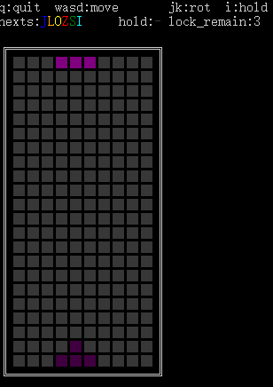

# 刻在DNA中的DTPC.gif


 - 抖动是录像软件的锅，并非渲染问题
 - 项目的重点是库，不是渲染

# What is it?

A modern Tetris (pure) C language library, including
- Super Rotation System(SRS)
- Ghost piece
- API support for "Hold piece"
- API support for customized tetromino generator
- Random Generator("random bag" or "7 system")
- API support for garbage lines
- Block colors are supported
- Does NOT rely on any library

An example in windows terminal.

# 这是什么玩意

一个现代俄罗斯方块的纯c语言实现，具有以下游戏特性
- SRS旋转系统
- 影子显示（ghost piece）
- 支持Hold
- 支持自定义的发牌系统
- 内置7bag发牌系统
- 填充垃圾行
- 场景中可以有多种颜色

并且有下面的程序特性：
- 数据驱动，可以直接将`FTE_GAME`和`FTE_7BAG`按照二进制传输或存储，游戏状态能够正常任意回退或前进
- 不依赖任何库、不存在动态内存申请和函数指针的行为，移植方便
  
提供一个样例程序`main.c`，请在windows下使用`cygwin`进行`make`编译，运行时请使用powershell或cmd，也可以编译为控制台程序后直接双击运行。如果遇到乱码问题，请切换为支持`Code Page 437`显示的字体。


# 文件说明/版权声明

`libftetris.c`和`libftetris.h`是实现srs系统的核心，受GPL许可证保护。  
`main.c`及`makefile`是Windows下的控制台实现，其中除main函数外，都不依赖windows的接口。
# TL;DR

这里是太长不看系列  


### 游戏初始化
游戏对象的初始化函数，参数是结构体指针，这个结构体用于存放游戏所需的全部数据
```c
void fteGameInit(FTE_GAME * game);
```

你可以维护多个game对象，这在多人对战的时候会很有用。  
比较理想的使用场景是，对象序列化后可以通过网络传输。  

### 7bag初始化
7 bag系统的初始化函数，也需要传一个结构体进去，还需要一个随机数种子，相同的随机数种子会产生相同的序列  
```c
void fte7BagInit(FTE_7BAG * bag,unsigned int seed);
```

### 函数约定

下面的每个函数都会修改game对象的状态，你需要不断读取game中的一些数据并显示出来

### 游戏操作 - 旋转

```c
fte_result_t fteRotLeft(FTE_GAME * game);
fte_result_t fteRotRight(FTE_GAME * game);
```
返回值有：
- `FTE_RESULT_MOVE_FAILED` 旋转失败
- `FTE_RESULT_MOVE_SUCCESS` 旋转成功
- `FTE_RESULT_MOVE_WALLKICK` 踢墙旋转成功 **请以此作为tspin奖励的判定依据**

### 游戏操作 - 移动
```c
fte_result_t fteMoveLeft(FTE_GAME * game);
fte_result_t fteMoveRight(FTE_GAME * game);
fte_result_t fteMoveDown(FTE_GAME * game);
```
返回值有：
- `FTE_RESULT_MOVE_FAILED` 移动失败
- `FTE_RESULT_MOVE_SUCCESS` 移动成功
  
建议将左右移动和下移交给用户去控制。你需要每隔一段时间调用一次fteMoveDown，以提供重力。如果调用返回`FTE_RESULT_MOVE_FAILED`，说明到底了，此时请考虑根据情况生成下一个砖块。

反复调用fteMoveDown，直到返回`FTE_RESULT_MOVE_FAILED`，可以作为HardDrop的实现。

### 游戏操作 - 生成
```c
fte_result_t fteSpawnNext(FTE_GAME * game,fte_tetromino_t next,int * clean_count /* OUTPUT parameter, line count of clean*/);
```
这个函数做三件事：
- （默认场上当前浮动的块是固定的）
- 清除场上已满的行
- 将缓存的垃圾行送上场
- 生成新的块

你需要指定下一个生成的方块next。它可以是：
```c
#define FTE_TETROMINO_I 1
#define FTE_TETROMINO_O 2
#define FTE_TETROMINO_T 3
#define FTE_TETROMINO_S 4
#define FTE_TETROMINO_Z 5
#define FTE_TETROMINO_J 6
#define FTE_TETROMINO_L 7
```
建议通过7bag系统生成。

如果clean_count指针不是NULL，会将清除行的数量赋给这个地址。**请以此作为消行的依据**。  
返回值为：

- `FTE_RESULT_MOVE_FAILED` 新块正常产生
- `FTE_RESULT_MOVE_SUCCESS` 新块被挡住没法产生 **请以此作为游戏结束的依据之一**

### 游戏操作 - 替换
```c
fte_result_t fteReplaceCurrentTetromino(FTE_GAME * game,fte_tetromino_t new_tetromino);
```
替换场上当前的块为new_tetromino，可据此实现Hold功能。

### 游戏配置 - 影子
```c
void fteGameSetGhost(FTE_GAME * game,int isShow);
```
开关影子，影子的颜色是`FTE_COLOR_GHOST`，直接被渲染在游戏场景中，请根据当前浮动的块来决定真正的颜色。

### 取得当前浮动的块
```c
fte_tetromino_t fteGetCurrentTetromino(FTE_GAME * game);
```
### 缓冲垃圾行

```c
void fteAddGarbage(FTE_GAME * game,fte_color_t garbage[FTE_WIDTH]);
```
增加一行垃圾行，garbage是一个由颜色组成的数组，需要至少有一个`FTE_COLOR_NONE`，这个垃圾行会被缓冲起来，并不会立即上场。

### 7bag

```c
fte_tetromino_t fte7BagGenItem(FTE_7BAG * bag);
```

不断调用这个函数，会产生不同的结果，它产生的值是下面之一：
```c
#define FTE_TETROMINO_I 1
#define FTE_TETROMINO_O 2
#define FTE_TETROMINO_T 3
#define FTE_TETROMINO_S 4
#define FTE_TETROMINO_Z 5
#define FTE_TETROMINO_J 6
#define FTE_TETROMINO_L 7
```
且符合7bag系统的生成规律。你可以把这个值直接送给`fteSpawnNext`函数，也可以放到一个队列里缓存起来，作为next显示的依据，然后再送给`fteSpawnNext`。

### 游戏场景绘制

游戏场景位于game对象的game.colors，是一个二维数组，默认长度为：`[10][40]`，表示宽和高。建议通常需要绘制22行。
数组中每个元素为：
```c
#define FTE_COLOR_NONE 0
#define FTE_COLOR_I 1
#define FTE_COLOR_O 2
#define FTE_COLOR_T 3
#define FTE_COLOR_S 4
#define FTE_COLOR_Z 5
#define FTE_COLOR_J 6
#define FTE_COLOR_L 7
#define FTE_COLOR_GARBAGE 8
#define FTE_COLOR_GHOST   9
```
其中`FTE_COLOR_NONE`表示空白，其它的颜色都会进行碰撞检测（当`FTE_COLOR_GHOST`不在正确的位置时，也会受到碰撞检测，所以请不要在开启影子的条件下自行修改color数组）。你可以根据不同的情况进行渲染，建议根据[Tetris Guideline](https://harddrop.com/wiki/Tetris_Guideline)中的颜色进行绘制。颜色值可参考[w3](https://www.w3.org/wiki/CSS/Properties/color/keywords)或其它类似标准。

### 当心线程安全

本库并不是线程安全的，为了游戏少出BUG，并维持一个早睡早起的健康作息，请不要在多个线程上操作（修改）同一个game对象。  
不同的线程可以同时操作不同的game对象，这会给联机同步提供极大的便利。